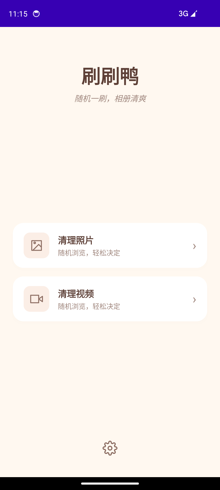
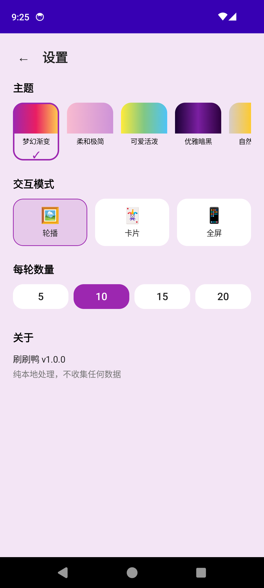
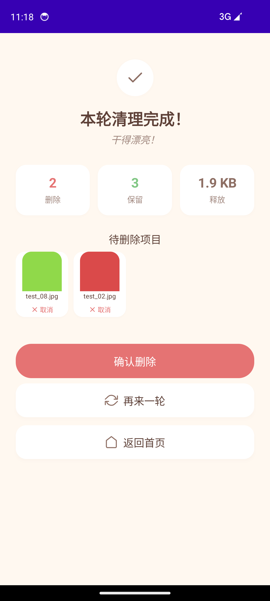
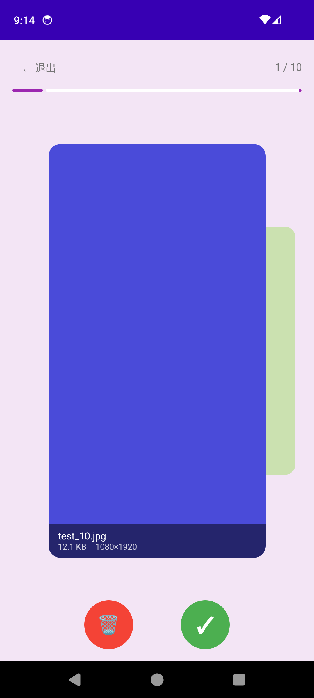
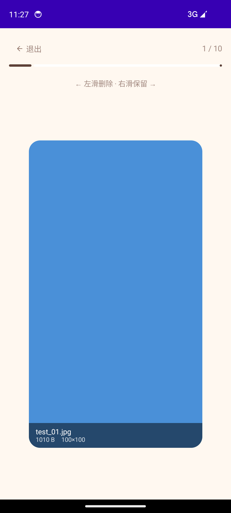
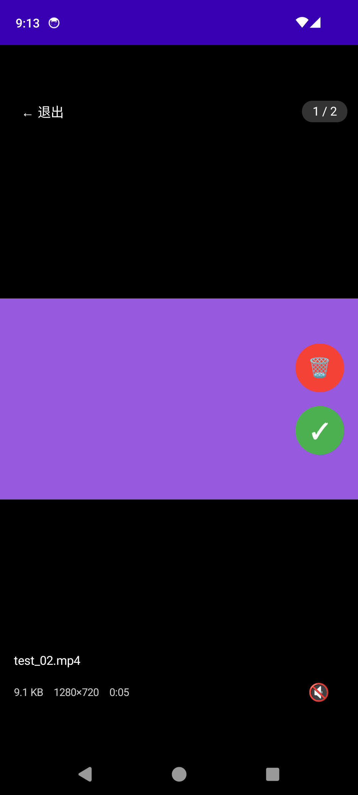
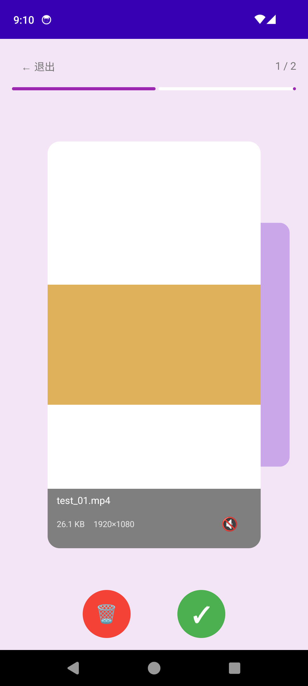
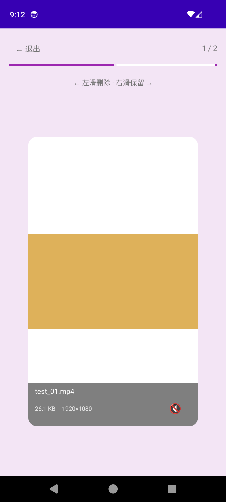

# 刷刷鸭

> 随机一刷，相册清爽

一款精致的相册随机清理工具。在碎片时间打开 App，随机浏览几张照片或视频，轻松决定去留，释放手机存储空间。

## 功能特性

- **随机清理** — 不用翻遍相册，随机挑选一小批，降低决策负担
- **照片 + 视频** — 支持照片和视频的随机浏览与批量清理
- **3 种交互模式** — 轮播相册式 / 卡片左右滑 / 全屏上下滑
- **5 套主题** — 梦幻渐变 / 柔和极简 / 可爱活泼 / 优雅暗黑 / 自然温暖
- **安全删除** — 浏览时仅标记，结果页统一确认，支持反悔
- **纯本地** — 无网络请求，不收集任何用户数据

## 截图

### 首页 / 设置 / 结果页

| 首页 | 设置页 | 结果页 |
|------|--------|--------|
|  |  |  |

### 三种浏览模式

| 轮播相册式 | 卡片左右滑 | 全屏沉浸式 |
|-----------|-----------|-----------|
|  |  |  |

### 视频播放（轮播 / 卡片模式内联播放 + 静音控制）

| 轮播模式播放视频 | 卡片模式播放视频 |
|----------------|----------------|
|  |  |

## 技术栈

| 项目 | 技术 |
|------|------|
| 语言 | Kotlin (Multiplatform) |
| UI 框架 | Compose Multiplatform |
| 目标平台 | Android 8.0+ / iOS 14.0+ / HarmonyOS NEXT 5.0+ |
| 构建工具 | Gradle 8.5 + AGP 8.2.2 |
| E2E 测试 | Maestro |

## 项目结构

```
cleanpic/
├── shared/                     # KMP 共享模块
│   └── src/
│       ├── commonMain/         # 跨平台共享代码
│       │   └── kotlin/com/cleanpic/
│       │       ├── ui/         # Compose UI（5 个页面）
│       │       ├── viewmodel/  # ViewModel 层
│       │       ├── model/      # 数据模型
│       │       ├── media/      # 媒体仓库 + 随机选取
│       │       ├── theme/      # 主题管理（5 套）
│       │       ├── settings/   # 偏好设置
│       │       ├── permission/ # 权限管理
│       │       └── di/         # 依赖注入
│       ├── androidMain/        # Android 平台实现
│       ├── appleMain/          # iOS 平台实现
│       └── commonTest/         # 单元测试（28 用例）
├── androidApp/                 # Android 壳工程
├── maestro/flows/              # E2E 测试流程（16 个）
├── scripts/                    # 构建/运行/测试脚本
├── test-assets/                # 测试媒体（本地生成）
└── docs/                       # 产品/架构/测试文档
```

## 快速开始

### 环境要求

- JDK 17
- Android Studio（含 Android SDK 34）
- ffmpeg（用于生成测试媒体，可选）
- Maestro（用于 E2E 测试，可选）

可以运行以下命令一键检查环境是否就绪：

```bash
scripts/check-env.sh
```

### 第一步：启动模拟器

在 Android Studio 中创建一个 AVD（推荐 Pixel 6 / API 34），然后：

```bash
# 启动模拟器（会自动等待启动完成，并注入测试媒体）
scripts/emulators/android.sh start

# 如需冷启动（忽略快照）
scripts/emulators/android.sh start --cold

# 查看模拟器状态
scripts/emulators/android.sh status
```

> 如果已有模拟器运行中或连接了实机，可跳过此步。用 `adb devices` 确认设备在线即可。

### 第二步：构建 APK

```bash
scripts/build-android.sh
```

构建成功后，APK 输出路径：`androidApp/build/outputs/apk/debug/androidApp-debug.apk`

### 第三步：安装并启动 App

**方式一：使用脚本（推荐）**

```bash
# 安装 APK 到已连接的设备/模拟器
scripts/test-android.sh deploy
```

**方式二：手动安装**

```bash
# 安装
adb install -r androidApp/build/outputs/apk/debug/androidApp-debug.apk

# 启动 App
adb shell am start -n com.cleanpic.android/.MainActivity
```

App 启动后，授予相册权限即可开始使用。

### 一键完整流程

如果你想从构建到 E2E 测试一步到位：

```bash
# 构建 + 部署 + 运行 E2E 测试（需要模拟器已启动 + Maestro 已安装）
scripts/test-android.sh
```

### 运行测试

```bash
# 单元测试（28 用例）
scripts/test.sh

# 生成测试媒体（12 张照片 + 2 个视频，E2E 测试前需要）
scripts/generate-test-assets.sh

# E2E 测试（需要 Maestro + 模拟器 + 已部署 App）
scripts/test-android.sh e2e
```

### 打包 Release APK

```bash
./gradlew :androidApp:assembleRelease
# 输出: androidApp/build/outputs/apk/release/androidApp-release.apk
```

## 测试覆盖

### 单元测试（L1）

| 测试类 | 用例数 | 覆盖 |
|--------|--------|------|
| RandomPickerTest | 7 | 随机选取、去重、边界 |
| ThemeManagerTest | 4 | 主题切换、Token 完整性 |
| AppSettingsTest | 3 | 读写、默认值、非法值防御 |
| ViewerViewModelTest | 13 | 加载、标记、删除、统计 |
| PlatformTest | 1 | 平台标识 |

### E2E 测试（L4）

| 流程 | 场景 | 内容 |
|------|------|------|
| browse-photos | E01 | 完整照片清理：标记删除/保留 → 结果页验证 |
| delete-confirm | E04 | 全部标记删除 → 确认删除 |
| keep-all | E03 | 全部保留 → 验证无删除按钮 |
| next-round | E02 | 完成一轮 → 再来一轮 |
| video-cleanup | E07 | 视频清理流程 |
| switch-theme | E14 | 切换到优雅暗黑主题 |
| swipe-card-mode | E11 | 卡片左右滑手势操作 |
| round-count | E17 | 设置每轮数量为 5 |
| photo-thumbnail | E04 | 照片缩略图展示验证 |
| video-thumbnail | E06 | 视频缩略图+时长展示验证 |
| swipe-card-thumbnail | E10 | 卡片模式缩略图展示 |
| fullscreen-video-playback | E09 | 全屏模式视频自动播放 |
| result-stats-layout | E12 | 结果页统计布局验证 |
| exit-button | E19 | 三种模式中途退出按钮 |
| carousel-video-playback | E08a | 轮播模式视频播放+静音 |
| swipecard-video-playback | E08b | 卡片模式视频播放+静音 |

## 开发路线图

### V1.0（当前）

- [x] 随机照片清理（浏览 + 标记 + 确认删除）
- [x] 随机视频清理
- [x] 5 套主题切换
- [x] 3 种交互模式（轮播/卡片滑动/全屏）
- [x] 每轮数量可配置（5/10/15/20）
- [x] 批量延迟删除 + 反悔
- [x] 再来一轮（自动去重）
- [x] Android 权限请求流程
- [x] 单元测试 28 用例 + E2E 16 流程

### V1.1（待开发）

- [x] ~~真实照片/视频缩略图加载~~（已在 V1.0 完成，Coil 3）
- [x] ~~视频播放器集成~~（已在 V1.0 完成，ExoPlayer，三种模式均支持）
- [ ] iOS 平台适配
- [ ] 删除动画效果
- [ ] 相册权限 LIMITED 模式下的增量授权引导

### V1.2（规划中）

- [ ] HarmonyOS NEXT 适配
- [ ] 数据统计（累计清理张数、释放空间）
- [ ] 清理历史记录
- [ ] Widget 桌面小组件（"今日清理"快捷入口）
- [ ] 减少动效模式（响应系统无障碍偏好）

### V2.0（远期）

- [ ] AI 智能分类（模糊照片、截图、重复照片自动标记）
- [ ] 云端备份提醒（检测到未备份照片时提示）
- [ ] 社交分享（清理成就卡片）

## 文档索引

| 文档 | 路径 |
|------|------|
| 产品需求 | [docs/product/prd.md](docs/product/prd.md) |
| 用户故事 | [docs/product/user-stories/](docs/product/user-stories/) |
| 系统架构 | [docs/architecture/overview.md](docs/architecture/overview.md) |
| 技术栈选型 | [docs/architecture/tech-stack.md](docs/architecture/tech-stack.md) |
| 主题系统 | [docs/architecture/cleanpic/theme-system.md](docs/architecture/cleanpic/theme-system.md) |
| 测试策略 | [docs/testing/strategy.md](docs/testing/strategy.md) |
| 测试场景 | [docs/testing/scenarios/](docs/testing/scenarios/) |

## 许可证

私有项目，保留所有权利。
