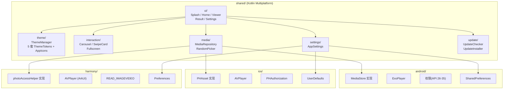

# CleanPic — 系统架构总览

|文档状态| 初稿 | 2026-03-28 |

## 设计目标

| 目标 | 描述 |
|------|------|
| 三端统一 | 一套 Kotlin 共享代码同时运行在 Android、iOS、HarmonyOS |
| 原生性能 | 照片/视频加载零桥接开销，动画 >= 55fps |
| 可主题化 | 语义化 Token 架构，5 套主题（各含独立布局）一键切换，所有图标为矢量绘制 |
| 安全删除 | 批量延迟删除，1 次系统弹窗，支持反悔 |
| 近本地 | 除版本检查外无网络请求，不收集任何用户数据 |

## 架构图



## 组件职责表

| 组件 | 职责 | 所在层 |
|------|------|--------|
| ui/splash | 启动页 Logo + 主题色动画 | shared |
| ui/home | 首页两大按钮 + 设置入口 | shared |
| ui/viewer | 核心浏览页，承载 3 种交互模式 | shared |
| ui/result | 结果统计 + 删除确认 + 再来一轮 | shared |
| ui/settings | 主题/模式/数量切换 | shared |
| ThemeManager | 主题状态管理，切换时更新全局 Token + 布局标识 | shared |
| AppIcons | 统一矢量图标入口，根据主题 Token 返回对应风格的 ImageVector | shared |
| InteractionMode | 3 种浏览交互的统一接口 | shared |
| MediaRepository | 媒体查询/删除的跨平台抽象 (expect/actual) | shared + 各平台 |
| RandomPicker | 随机不重复选取 + 会话级去重 | shared |
| AppSettings | 偏好持久化的跨平台抽象 (expect/actual) | shared + 各平台 |
| VideoPlayer | 视频播放的跨平台抽象 (expect/actual) | shared + 各平台 |
| UpdateChecker | 版本检查逻辑（调用远程 API，比较版本号） | shared |
| UpdateInstaller | 下载安装更新的跨平台抽象 (expect/actual) | shared + 各平台 |

## 子文档导航

| 子模块 | 文档 | 说明 |
|--------|------|------|
| 数据流与状态 | [cleanpic/overview.md](cleanpic/overview.md) | 数据流、导航栈、状态管理、删除策略、持久化 |
| 主题系统 | [cleanpic/theme-system.md](cleanpic/theme-system.md) | Token 定义（v2：含布局标识+图标参数）、5 套新主题、矢量图标系统、页面分发架构 |
| 原生 Module | [cleanpic/native-modules.md](cleanpic/native-modules.md) | MediaModule/PermissionModule/VideoPlayer 各平台实现 |
| 自动升级 | [cleanpic/auto-update.md](cleanpic/auto-update.md) | UpdateChecker/UpdateInstaller + Cloudflare Workers 后端 |
| 技术栈选型 | [tech-stack.md](tech-stack.md) | 框架选型对比与最终决策 |
| 领域模型 | [domain-model.md](domain-model.md) | 业务术语 <-> 技术术语映射 SSOT |

## 代码目录结构

```
cleanpic/
├── shared/
│   ├── ui/          — Splash / Home / Viewer / Result / Settings
│   ├── theme/       — ThemeManager + 5 套 ThemeTokens + AppIcons
│   ├── icons/       — 统一矢量图标入口 (ImageVector)
│   ├── interaction/ — CarouselMode / SwipeCardMode / FullscreenMode
│   ├── media/       — MediaRepository(expect) + RandomPicker
│   └── settings/    — AppSettings(expect)
├── android/         — MediaStore + ExoPlayer + SharedPreferences
├── ios/             — PHAsset + AVPlayer + UserDefaults
├── harmony/         — photoAccessHelper + AVPlayer + Preferences
├── scripts/         — 构建/运行脚本
└── docs/            — 本文档体系
```

## 安全与隐私

- 除版本检查外纯本地处理，版本检查仅传输当前版本号和平台标识，不收集任何用户数据
- 仅申请相册读取和删除权限及网络权限（用于版本检查），不申请无关权限
- 上架前准备隐私政策文档

## 无障碍设计

- 所有按钮/图片设置 contentDescription / accessibilityLabel
- 各主题文字与背景色对比度达 WCAG AA (4.5:1)
- 响应系统"减少动态效果"偏好
- 可点击元素最小触控区域 44x44pt
